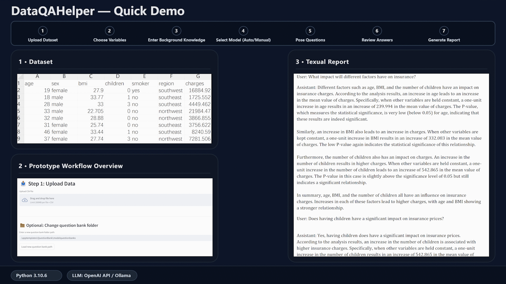
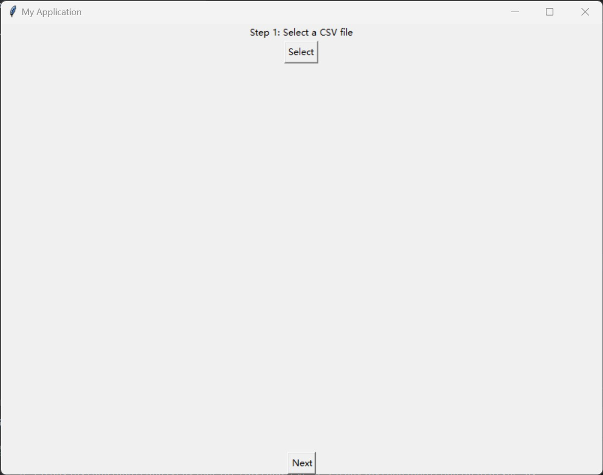
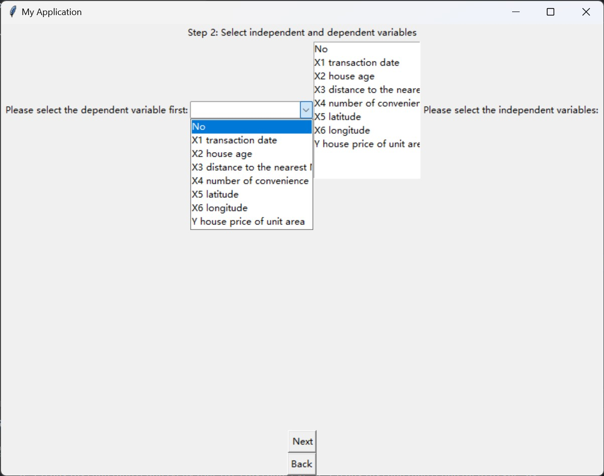
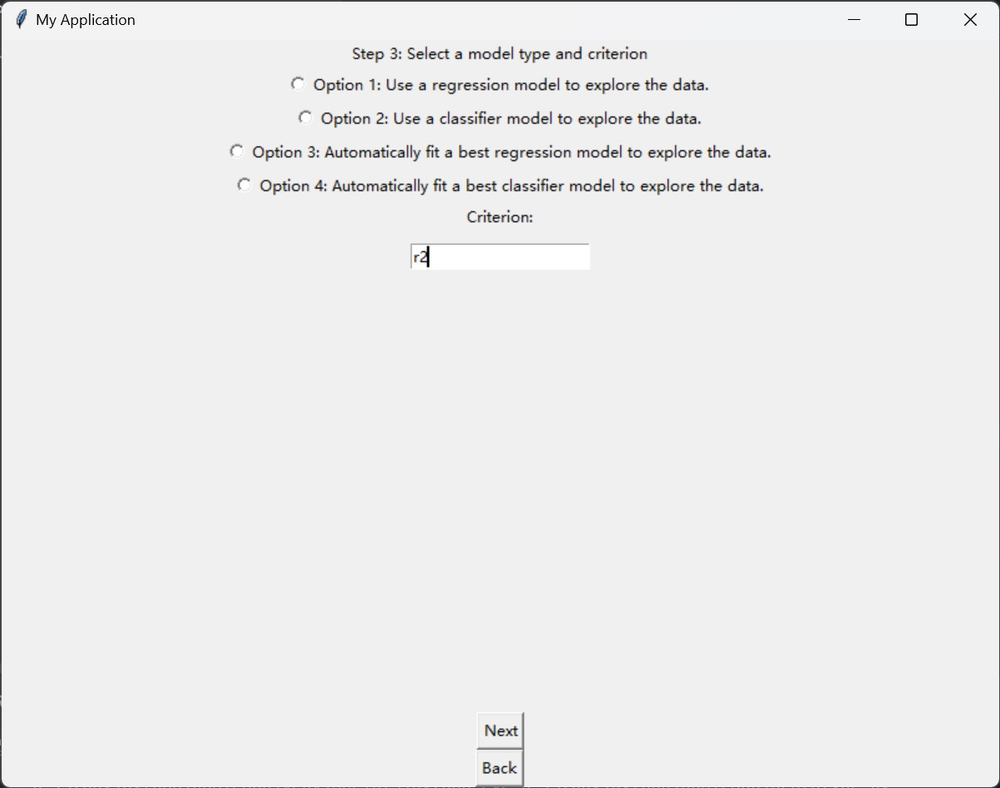
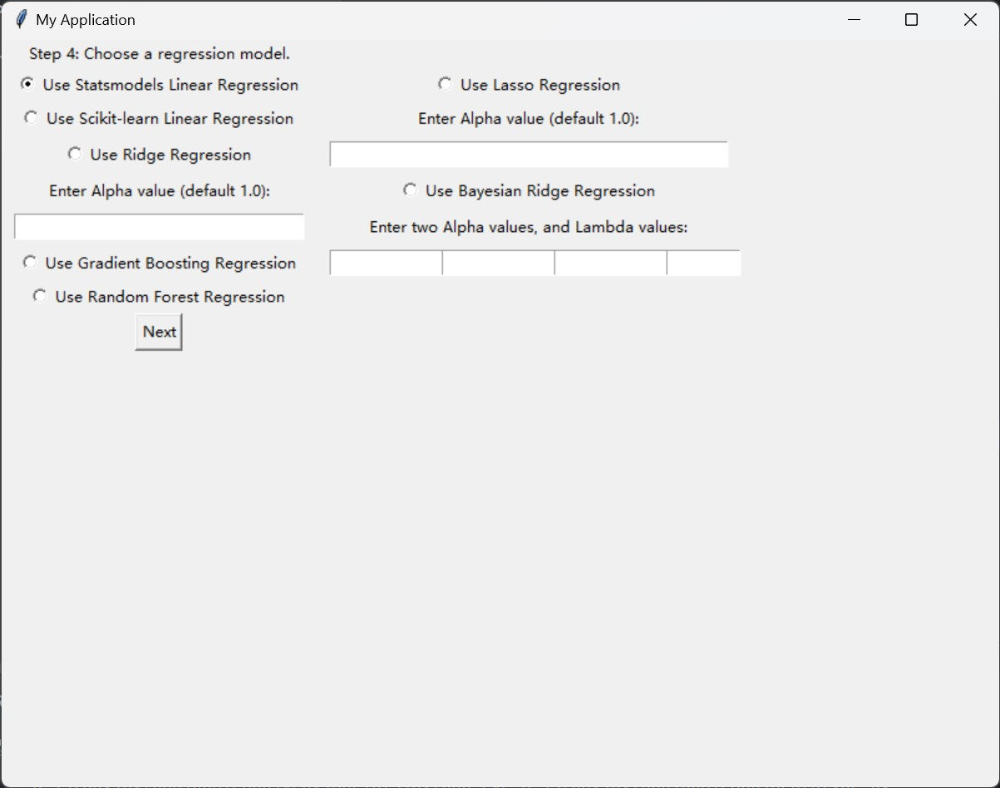
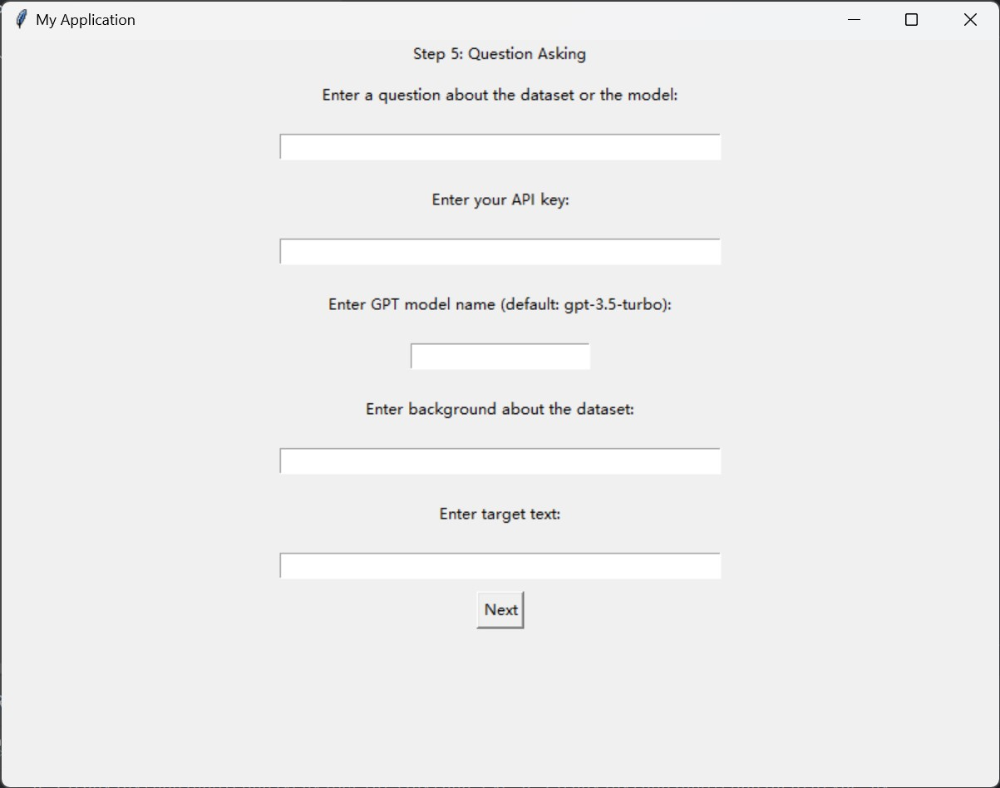
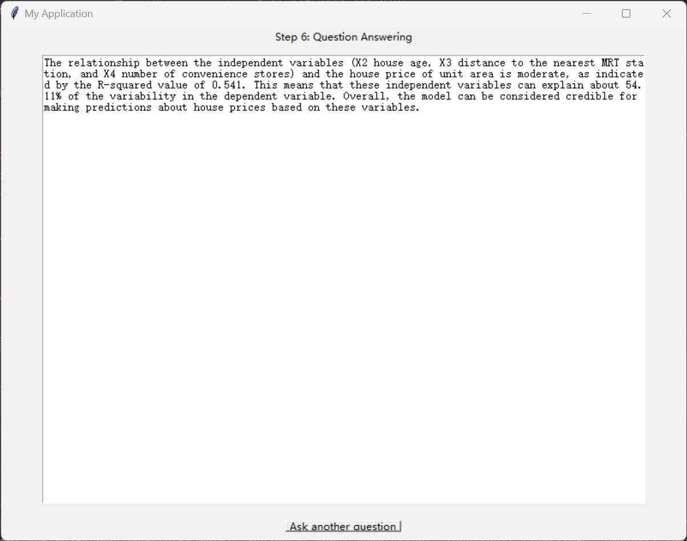
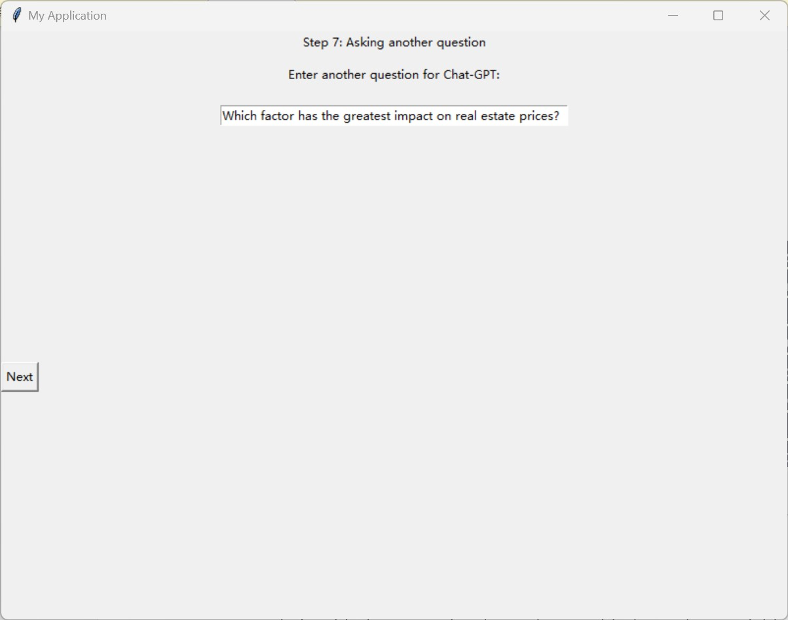
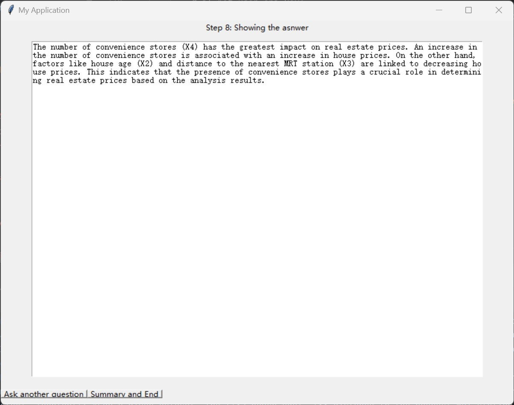

# DataQAHelper💻

###### 
## 🚀 Quick Demo

<p align="center">
  

A question-centred framework that couples model recommendation/fitting with template-guided LLM generation to deliver interpretable, reproducible data-to-text reports—supporting OpenAI API or local Ollama backends while curbing hallucinations and incomplete responses.
</em></p>

# Overview:
This document provides an overview of how you can use this tool in your data exploration workflow.

Note: This document assumes that you already have an OpenAI API key or Ollama installed, and have cloned the package. If you have not done so already, please check out this [page for the API key](https://platform.openai.com/api-keys) and this [page for the package](https://github.com/tangjikededela/DataQAHelper2). To use local large language models (LLMs) through Ollama, please make sure you have [Ollama installed](https://ollama.com/) and downloaded a model (e.g., `deepseek-r1:14b`, etc.).

----

# About the framework:
DataQAHelper is a Python-based framework that integrates a wide array of commonly used data science algorithms along with a comprehensive question bank commonly used to interpret analysis results. Once a prototype is operational, it allows users to select the dataset they wish to analyze, pose questions, and either choose a machine learning model they wish to use or let the prototype automatically select the most appropriate model. Subsequently, the prototype will perform model fitting to complete the data analysis and answer the user's questions based on the analysis results. This question-and-answer process can be repeated until the user is satisfied.

____
## System Requirements 
* Python version  - '3.10.6'
____

## Packages Requirement

### The following packages are required to run the prototype:
```
streamlit==1.43.1
pandas==1.5.3
numpy==1.23.5
scikit-learn==1.2.2
statsmodels==0.14.0
matplotlib==3.7.2
seaborn==0.13.2

jinja2==3.1.2
python-docx==0.8.11
requests==2.31.0
python-dotenv==1.0.1
openai==0.27.8
ollama==0.4.7

pycaret==3.0.4
xgboost==2.0.3
lightgbm==4.3.0
catboost==1.2.2
scikit-plot==0.3.7
imbalanced-learn==0.12.4
plotly==5.24.1

```
____
# Guidelines
## Requirements Installation
Before getting started, please make sure that the Python version is 3.10.6, and Microsoft Visual C++ 14.0 or greater is installed. Get it with: ["Microsoft C++ Build Tools"](https://visualstudio.microsoft.com/visual-cpp-build-tools/). Then, please use the following command to install the necessary packages:
```
pip install -r requirements.txt
```
After completing the installation, you can run **any of the following commands in your terminal** to launch a specific prototype:

```
streamlit run stUIforAPI.py
```

> 🆕 This is the **latest prototype** with enhanced visual UI.  
> It supports model recommendation based on user questions, model fitting, and both local/API-based LLM question-answer generation.  
> It also includes an improved data browsing interface with visualizations.


```
python defaultUI.py
```

> 🗂 This is an **original lightweight prototype**, which supports model fitting and uses the OpenAI API for LLM-based answering.


```
python defaultUIforLocal.py
```

> 🗂 This is an **original lightweight prototype**, which supports model fitting and uses the local LLM answering via Ollama.

## Prototype workflow
- [Prototype Workflow — Updated UI (Streamlit)](#prototype-workflow--updated-ui-streamlit)
## Prototype Workflow (New UI)

**Step 1: Upload Dataset**  
Upload a CSV file via the file uploader. A preview of the data, summary metrics (row count, number of variables, missing values), and a scrollable table are displayed.  
*Optional:* specify a custom folder for the question bank (a directory containing `.txt` files), then click **Load new question bank path** to refresh question sources.  


**Step 2: Select Variables**  
Choose the **dependent (target) variable** and one or more **independent (feature) variables** from the dropdowns.  


**Step 3: Confirm Selection & Choose LLM Source**  
Review a concise summary of the current selection. Inspect descriptive statistics and simple visualizations (distribution for the target; summary for features).  
Select the LLM source for subsequent question matching and answer generation:  
- **Use local Ollama** (no API key; requires a locally installed model), or  
- **Call OpenAI API** (provide model name and API key).  
Proceed when the configuration is correct.  


**Step 4: Enter Dataset Background Knowledge**  
Provide a succinct textual description of the dataset (domain context, variable semantics, data collection notes). This background is injected into the LLM context and used to improve question matching and answer quality. Save to continue.  


**Step 5: Batch Questions & Model Recommendation**  
Paste a numbered list of questions (e.g., `1. … 2. … 3. …`). The system parses them and computes **question–model match counts** against the loaded question banks.  
- The **recommended model(s)** are highlighted based on the highest match counts.  
- You may **Skip recommendation** to proceed directly to model selection.  


**Step 6: Select and Fit a Model**  
Choose **one** task family—**Regression** *or* **Classification**—and then pick a specific model or use **Auto-fit Best**:  
- *Regression:* Statsmodels OLS, scikit-learn Linear/Ridge/Lasso/Bayesian Ridge/Gradient Boosting/Random Forest, or Auto-fit Best.  
- *Classification:* Logistic Regression, Linear Discriminant Analysis, Linear SVM, Ridge Classifier, Random Forest, Decision Tree, or Auto-fit Best.  
The system performs data cleaning, trains the model, and reports key outputs (e.g., coefficients with p-values, \(R^2\), train/test metrics, or accuracy with train/test splits).  


**Step 7: Ask a Single Question**  
Enter a specific question about the dataset or fitted model. The system automatically matches the question to a relevant template section (e.g., accuracy, importance, overfitting, coefficients/p-values) and composes a draft answer grounded in model outputs.  
Answers are generated via the selected LLM source (Ollama or OpenAI).  


**Step 8: Review Answers & Generate Summary Report**  
Inspect the generated answer. You may:  
A. **Ask again** (iterate with another single question), or  
B. **Generate summary** to consolidate the Q&A into a concise report focused on the user’s questions and model findings.  
A `.docx` report of the session is saved (including the conversation context), enabling archival and reproducibility.  


- [Prototype Workflow — Original (Lightweight)](#prototype-workflow--original-lightweight)
**Step 1:**  
The user selects the dataset they wish to analyze.

**Step 2:**  
The user selects the independent and dependent variables.

**Step 3:**  
The user selects the type of machine learning (regression fitting or classification) / The user can let the prototype automatically select the most suitable model based on the criteria provided by the user.

**Step 4:**  
Select a required model and set hyperparameters / Check the results of the automatically selected model.

**Step 5:**  
The user needs to provide:  
1. A question they want to learn about from the dataset.  
2. Their OpenAI key.  
3. The model number used (optional).  
4. Background knowledge about the dataset (optional).  
5. A target text snippet to ensure the style and terminology of the output answer remain consistent (optional).

**Step 6:**  
Review the answer from the prototype.

**Step 7:**  
Pose another question.

**Step 8:**  
Review the answer from the prototype and choose to:
A. Repeat Step 7. OR  
B. Summarize all Q&As and generate a textual report.

